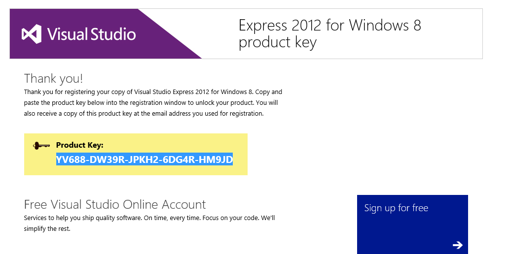

# windows

Notes on installing cordova on windows8:

* need visual studio express 2012 for windows 8
* in order to make cordova run work, you need to set in powershell: Set-ExecutionPolicy Unrestricted

hmm, I am not able to make cordova run working on windows wiaht an admin cmd:

