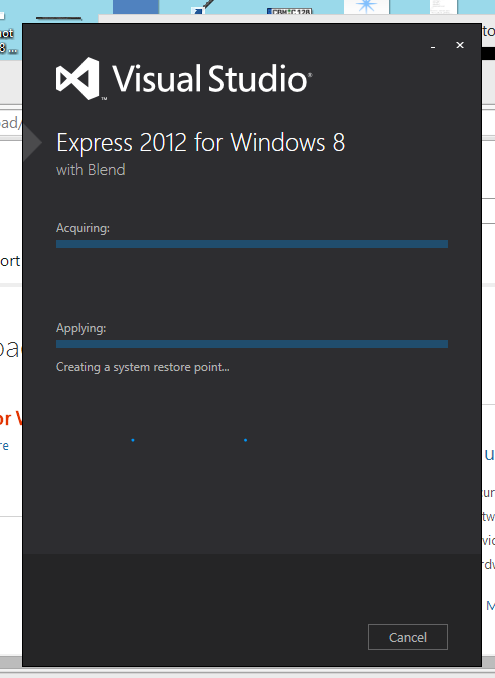

# windows

Notes on installing cordova on windows8:

* the hardest thing to do is: allowing your current user to be allow to create symbolic links

* need visual studio express 2012 for windows 8
* in order to make cordova run work, you need to set in powershell: Set-ExecutionPolicy Unrestricted

